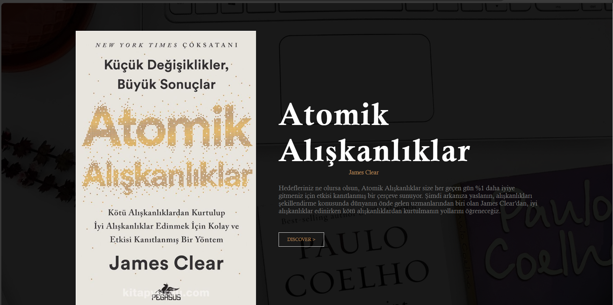
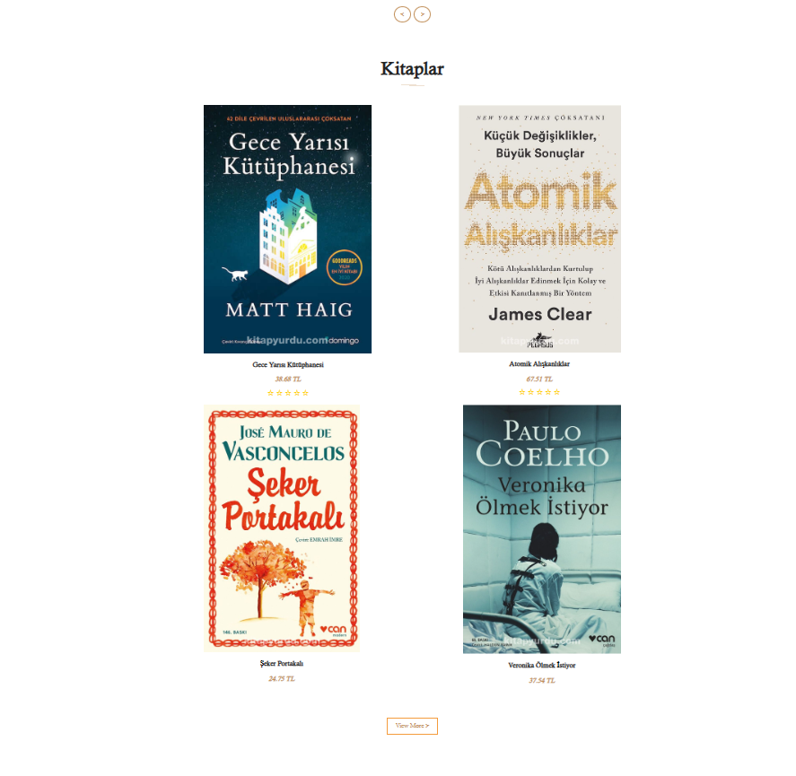
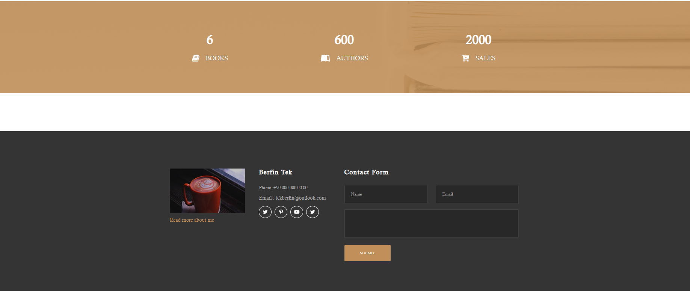

# Book Sale Web Site





 
This project was made to create a dynamic website with Django and to learn Django. I took the project's interface from the website (https://www.free-css.com/) and arranged it according to my needs.

# USAGE 

```bash
# Create env
$ python -m venv env

# Install Django
$ pip install Django

# Activate env
$ env\Scripts\activate

# Install Pillow
$ python -m pip install Pillow

# Install libraries
$ cd booksale_con
$ pip install -r requirements.txt

# Run it
$ python manage.py runserver

# Go to 8000 server
$ http://localhost:8000/
```
